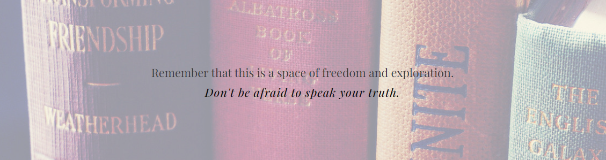
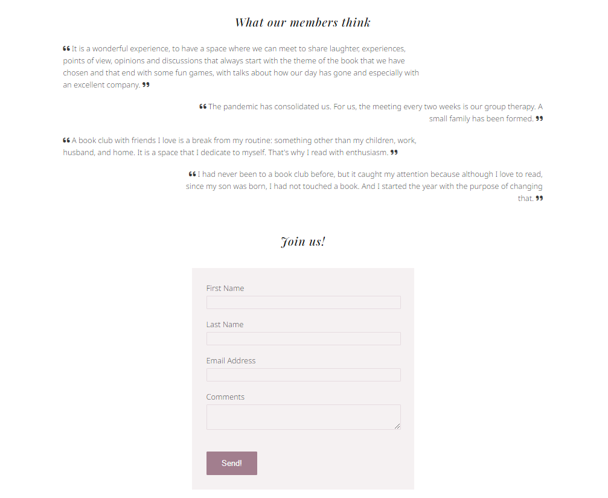
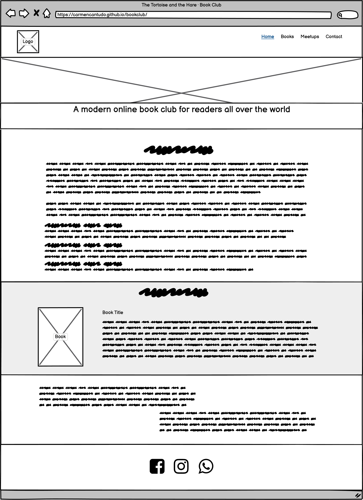
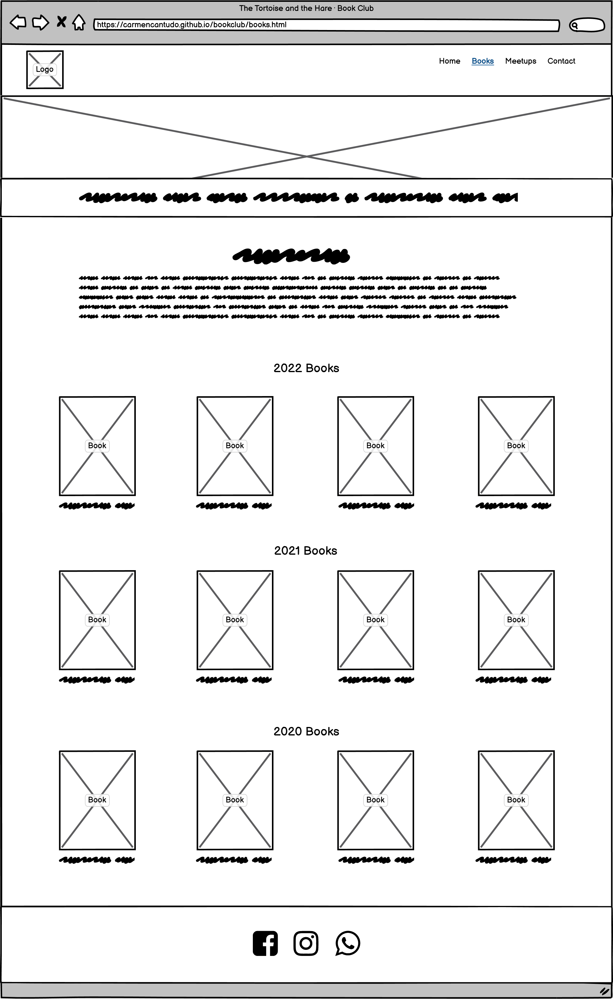
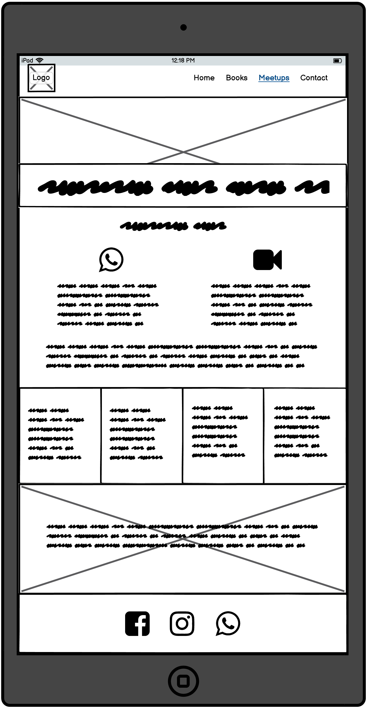
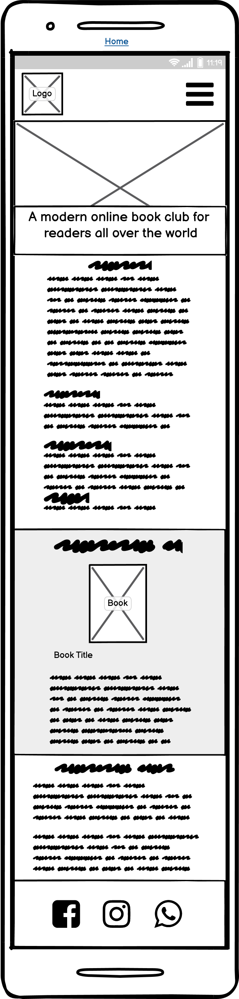
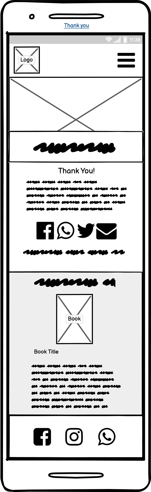

# Book Club

Book Club hopes to help people recover their reading habits, make new friends, and discover books they never thought they would like.

The site will target readers who need a way to escape from the routine and are looking to socialise and learn new things.

Book Club will be helpful for readers to see what book to read next and when they should be joining the next meeting to discuss it.

The Book Club site is live and can be seen <a href="https://carmencantudo.github.io/bookclub/" target="_blank">HERE!</a>

 

## Table of Contents
- [Book Club](#book-club)
  - [Table of Contents](#table-of-contents)
  - [Features](#features)
    - [Existing Features](#existing-features)
    - [Future Features](#future-features)
  - [UX](#ux)
    - [Site Purpose](#site-purpose)
    - [Site Goal](#site-goal)
    - [Audience](#audience)
    - [Communication](#communication)
    - [Current User Goals](#current-user-goals)
    - [New User Goals](#new-user-goals)
  - [Design](#design)
    - [Colour Scheme](#colour-scheme)
    - [Typography](#typography)
    - [Imagery](#imagery)
    - [Wireframes](#wireframes)
  - [Testing](#testing)
    - [Validator Testing](#validator-testing)
  - [Technologies Used](#technologies-used)
    - [Main Languages Used](#main-languages-used)
    - [Frameworks, Libraries \& Programs Used](#frameworks-libraries--programs-used)
  - [Deployment](#deployment)
    - [Using Github Pages](#using-github-pages)
    - [How to Fork it](#how-to-fork-it)
    - [How to Clone it](#how-to-clone-it)
    - [Making a Local Clone](#making-a-local-clone)
    - [Issues encountered](#issues-encountered)
  - [Credits](#credits)
    - [Content](#content)
    - [Media](#media)
    - [Code](#code)
  - [Acknowledgements](#acknowledgements)

## Features
### Existing Features

 Navigation Bar 

This section is included on all pages and allows users to quickly navigate between the "Home", "Books", "Meetups", and "Contact" sections. It also has the logo on it. For small screens, the navigation bar changes into a collapsed menu.

 Landing page 

A picture with text overlay and a brief website description is included on the landing page. This section uses an eye-catching animation to draw the user's attention to the Book Club.

The What we do section contains a welcome statement as well as an explanation of the club's aspirations.

On the What we are reading section of the page we find the books we are currently reading, with an image and the description. This section has a different background colour to focus on it.

The last section on the Home page is the What we think section, and it contains some reviews from the club members.

 Books Page 

The first section also contains a picture with text overlay and a quote from Mark Twain *"Good friends, good books, and a sleepy conscience: this is the ideal life."*. This section uses an eye-catching animation to draw the user's attention to the Book Club.

Our books section gives some information and images of the books we have read, the ratings and a list of future readings.

 Meetups Page 

Another picture with text overlay and a quote from Irving Stone *"There are no faster or firmer friendships than those formed between people who love the same books."* can be found in this section that uses an eye-catching animation to draw the user's attention to the Book Club.

The following section explains how we connect with each other.

The meetups times section shows our following meeting sessions, the book we are reading and when we are meeting to discuss it.

The last section has some text to get people to join and an image in the background in a fixed position.

 Contact Page 

We find a picture again on this page with text overlay and a quote from Kristin Hannah *"Books + friendship = book club."*. It also uses an eye-catching animation to draw the user's attention to the Book Club.

The design is minimalistic once more. There is a form for new users to contact Book Club members and some comments and views from current Book Club members.

There is also a thank you page, which appears like this:

 The Footer 

- Links to the Book Club's social media sites are included in the footer area. The links will open in a new tab to make navigating more accessible for the user.
- The user benefits from the footer since it encourages them to stay connected via social media.

### Future Features

- A page with members photographs.
- A map with locations where we will meet.
- Future events.

 

## UX
### Site Purpose
To provide information on the Book Club, including its book selection, meeting dates, and how to join.

### Site Goal
To keep our existing book club members up to date on the books we are reading at the moment and our following meeting dates.

### Audience
Everyone who enjoys reading and wants to recover their reading habits, meet new people, and discover new books.

### Communication
The information is easily accessible to all visitors because of the website's straightforward design. Each page is labelled so that the user knows where they are always. Without having to conduct a thorough search, the information is readily available.

### Current User Goals
To stay up to date on new meeting days and current readings.

### New User Goals
- To be able to explore the site easily and comprehend the information offered.
- For the information to be current and relevant.
- To be motivated by a distinctive design that piques your interest right away and retains your attention on the site.

 

## Design
### Colour Scheme
The colour scheme was designed to provide as much contrast as possible without becoming excessive. The accompanying imagery displayed across the site gives the majority of the colour.

### Typography
+ Playfair Display: Medium 500 Italic for quotes and regular 400 for titles.
+ Noto Sans: Light 300 for the body.
+ Special Elite: it mimics a typewriter and is used on the navigation menu.
+ Amiri: For book descriptions.

### Imagery
The site's images were gathered from free stock photo websites, and the sources are listed in the Credits section. Each photo provided supports the site's theme and reminds the user that this is a website about books and social meetings.

### Wireframes

 Laptop 

Home page

Books page

Meetups page

Contact page

Thank you page

 IPad 

Home page

Books page

Meetups page

Contact page

Thank you page

 Mobile 

Home page

Books page

Meetups page

Contact page

Thank you page

 

## Testing

- The website was constantly tested during development using Chrome dev tools.
- Tested sign up and contact form with and without inputs in all fields.
- Tested all links on all pages.
- To improve web performance, the images format was change to WebP that provides better compression, which means faster downloads and less data consumption.

### Validator Testing
- HTML
  - No errors were returned when passing through the official <a href="https://validator.w3.org/nu/?doc=https%3A%2F%2Fcarmencantudo.github.io%2Fbookclub%2Findex.html" target="_blank">W3C validator</a>
- CSS
  - No errors were found when passing through the official <a href="https://jigsaw.w3.org/css-validator/validator?uri=https%3A%2F%2Fcarmencantudo.github.io%2Fbookclub%2Findex.html&profile=css3svg&usermedium=all&warning=1&vextwarning=&lang=en" target="_blank">(Jigsaw) validator</a>

 

## Technologies Used

### Main Languages Used
- HTML
- CSS

### Frameworks, Libraries & Programs Used
- Gitpod: to create my Html files & styling sheet before pushing the project to Github.
- GitHub: to store my repository for submission.
- Balsamiq Wireframes: to make the wireframes for the website.
- Adobe Illustrator and Procreate: to create the logo.
- Google Fonts: for the font families, Amiri, Noto Sans, Playfair Display, Special Elite.
- Am I Responsive?: to ensure the project looked good across all devices.
- Cloudinary: to store, transform, optimize, and deliver the media assets.
- Markdown cheat sheet: for Readme.

 

## Deployment

### Using Github Pages
In the GitHub Repository from the project <a href="https://github.com/carmencantudo/bookclub/" target="_blank">https://github.com/carmencantudo/bookclub/</a>

1. Click the 'Settings' Tab.
2. Scroll Down to the Git Hub Pages Heading.
3. Select 'Master Branch' as the source.
4. The Page will reload 'Settings' again.
5. Scroll to GitHub pages heading and there will now be a clickable link <a href="https://github.com/carmencantudo/bookclub/" target="_blank">https://github.com/carmencantudo/bookclub/</a>
6. Click this link for the live deployed page.

### How to Fork it
1. On GitHub, go to <a href="https://github.com/carmencantudo/bookclub/" target="_blank">CarmenCantudo/bookclub</a>.
2. In the top right, click "Fork".

### How to Clone it
1. Go to the main page of the repository.
3. Above the file list, click "Code".
4. Select HTTPS, SSH, or GitHub CLI and then click copy to clone it.
5. Open Git Bash.
6. Change the location of your cloned repository.
7. Type `git clone` and then paste the URL you copied.
8. Press “Enter” to create your clone.

### Making a Local Clone
1. Locate the <a href="https://github.com/carmencantudo/bookclub/" target="_blank">Repository</a> for the book club.
2. Click "Code".
3. Click Clone or Download.
4. Copy Git URL from the dialogue box.
5. Open a terminal window in a directory of your choosing using your preferred development editor.
6. Change the location to where you want the cloned directory to be.
7. Type `git clone`, and then paste the URL you copied.
8. Press Enter, and your local clone will be created.

### Issues encountered
- 

 

## Credits
### Content
The basic setup and aesthetic were based on the walk-through project "Love Running." I took the idea for the navigation bar design, the hero image and the display of social links in the footer section.

The form element's styling in "Love Running" served as a starting point for my form, which helped me recollect all of the aspects that needed to be addressed.

### Media
The following images are from <a href="https://www.pexels.com/" target="_blank">Pexel</a> and <a href="https://burst.shopify.com/" target="_blank">Burst</a>:
- Home page hero image: <a href="https://www.pexels.com/photo/light-inside-library-590493/" target="_blank">Photo by Janko Ferlic - Light Inside Library</a>
- Books page hero image: <a href="https://www.pexels.com/photo/close-up-on-old-book-10506690/" target="_blank">Photo by Wendy van Zyl - Close up on Old Book</a>
- Meetups hero image: <a href="https://burst.shopify.com/photos/notebook-with-coffee-books-and-rain" target="_blank">Photo by Rahul Pandit</a>
- Meetups background image: <a href="https://www.pexels.com/photo/closeup-photo-of-assorted-title-books-1122865/" target="_blank">Photo by Suzy Hazelwood</a>
- Contact and Thank you page hero image: <a href="https://www.pexels.com/photo/white-ceramic-teacup-with-saucer-near-two-books-above-gray-floral-textile-904616/" target="_blank">Photo by Thought Catalog</a>

The book descriptions and images are taken from <a href="https://books.google.com/" target="_blank">Google Books</a>:

List of books

<a href="https://books.google.ie/books?id=QBDGCQAAQBAJ&dq=The+Eight+Katherine+Neville" target="_blank">The Eight by Katherine Neville</a>

<a href="https://books.google.ie/books?id=ps9otgAACAAJ&dq=Murder+on+the+Orient+Express" target="_blank">Murder on the Orient Express by Agatha Christie</a>

<a href="https://books.google.ie/books?id=8NjDI5mGMo0C&dq=Kathryn+Stockett" target="_blank">The Help by Kathryn Stockett</a>

<a href="https://books.google.ie/books?id=zVq8BF_5vSUC&dq=The+Shining+by+Stephen+King" target="_blank">The Shining by Stephen King</a>

<a href="https://books.google.ie/books?id=tScwDwAAQBAJ&dq=Circe+by+Madeline+Miller" target="_blank">Circe by Madeline Miller</a>

<a href="https://books.google.ie/books?id=1EiJAwAAQBAJ&dq=sapiens+A+Brief+History+of+Humankind+Yuval+Harari" target="_blank">Sapiens: A Brief History of Humankind by Yuval Harari</a>

<a href="https://books.google.ie/books?id=UUk-AAAAQBAJ&dq=lethal+experiment+John+Locke" target="_blank">Lethal Experiment by John Locke</a>

<a href="https://books.google.ie/books?id=213ECwAAQBAJ" target="_blank">The Time Machine by H.G. Wells</a>

<a href="https://books.google.ie/books?id=1W8-c_m-noEC&dq=The+Color+Purple" target="_blank">The Color Purple by Alice Walker</a>

<a href="https://books.google.ie/books?id=fSqUrgEACAAJ&dq=The+Nightingale+by+Kristin+Hannah" target="_blank">The Nightingale by Kristin Hannah</a>

<a href="https://books.google.ie/books?id=gDVAEAAAQBAJ&dq=The+Little+Prince" target="_blank">The Little Prince by Antoine de Saint-Exupéry</a>

<a href="https://books.google.ie/books/about/What_You_Can_See_From_Here.html?id=bxFbEAAAQBAJ" target="_blank">What You Can See From Here by Mariana Leky</a>

<a href="https://books.google.ie/books?id=UeOFZwEACAAJ&dq=Sparkling+Cyanide" target="_blank">Sparkling Cyanide by Agatha Christie</a>

<a href="https://books.google.ie/books?id=QdCNeNx6LJUC&dq=Eat,+Pray,+Love" target="_blank">Memoir: Eat, Pray, Love by Elizabeth Gilbert</a>

<a href="https://books.google.ie/books?id=bMSKngEACAAJ&dq=the+prince+of+mist" target="_blank">The Prince of Mist by Carlos Ruiz Zafón</a>

<a href="https://books.google.ie/books?id=FzVjBgAAQBAJ&dq=The+Alchemist" target="_blank">The Alchemist by Paulo Coelho</a>

<a href="https://books.google.ie/books?id=vzu2OfYT0XUC&dq=The+Analyst" target="_blank">The analyst by John Katzenbach</a>

<a href="https://books.google.ie/books?id=tYiaxwEACAAJ&dq=Eleanor+%26+Park" target="_blank">Eleanor & Park by Rainbow Rowell</a>

<a href="https://books.google.ie/books?id=tQPECgAAQBAJ&dq=Pride+and+Prejudice" target="_blank">Pride and Prejudice by Jane Austen</a>

<a href="https://books.google.ie/books?id=V5s14nks9I8C&dq=Michael+Crichton" target="_blank">Jurassic Park by Michael Crichton</a>

<a href="https://books.google.ie/books?id=MUw_dAtcRjEC&dq=Men+Are+From+Mars,+Women+Are+From+Venus" target="_blank">Men Are from Mars, Women Are from Venus by John Gray</a>

<a href="https://books.google.ie/books?id=eP_WCQAAQBAJ&dq=Everything+You+and+I+Could+Have+Been+If+We+Weren%27t+You+and+I" target="_blank">Everything You and I Could Have Been If We Weren't You and I by Albert Espinosa</a>

<a href="https://books.google.ie/books?id=kotPYEqx7kMC&dq=george+orwell+1984" target="_blank">1984 by George Orwell</a>

<a href="https://books.google.ie/books?id=1OSCCAAAQBAJ&dq=A+Whole+New+World+Liz+Braswell" target="_blank">A Whole New World: A Twisted Tale by Liz Braswell</a>

<a href="https://books.google.ie/books?id=M53SDwAAQBAJ&dq=The+Midnight+Library" target="_blank">The Midnight Library by Matt Haig</a>

<a href="https://books.google.ie/books?id=XJNFfSzGD0AC&dq=life+of+pi" target="_blank">Life of Pi by Yann Martel</a>

<a href="https://books.google.ie/books?id=B7FL6zzN_FsC&dq=Good+Omens" target="_blank">Good Omens by Neil Gaiman and Terry Pratchett</a>

 

Logo icon: I made it myself using Procreate to draw the animals and Illustrator to convert it to vector and add the text around it.

### Code

Resources used in the process of the Book Club design and build:
- Flexbox: <a href="https://css-tricks.com/snippets/css/a-guide-to-flexbox/" target="_blank">A Complete Guide to Flexbox</a>
- Navigation bar toggle: <a href="https://youtu.be/xMTs8tAapnQ" target="_blank">Responsive Menu With Media Queries</a>
- Books page overlay information: <a href="https://www.w3schools.com/howto/howto_css_image_overlay_slide.asp" target="_blank">Image Overlay Slide</a>
- Share to Social Media: <a href="http://www.sharelinkgenerator.com/" target="_blank">Share Link Generator</a>

 

## Acknowledgements

- My mentor, Martina Terlevic, for the helpful feedback and support.